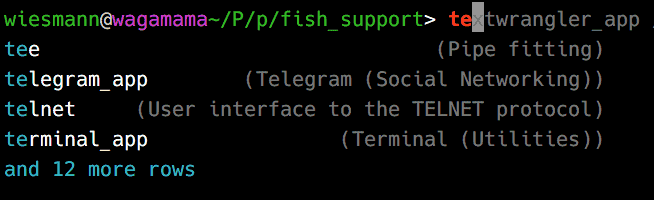

# Fish Support

Scripts to support and configure the [fish shell](https://github.com/fish-shell/fish-shell/) on Mac OS X.

## Alias configuration

The script `applications_to_fish_functions.py` creates a `fish` function for each Mac OS X application. It also populates the description field.



To use it, first generate functions for all Mac OS X applications

```shell
./applications_to_fish_functions.py > ~/.config/fish/app_functions
```

Then source that snippet from your fish configuration.

```shell
if test -f ~/.config/fish/app_functions
  . ~/.config/fish/app_functions
end
```

The script uses `mdls` to find all Mac OS X applications and to get meta-data about them. 

